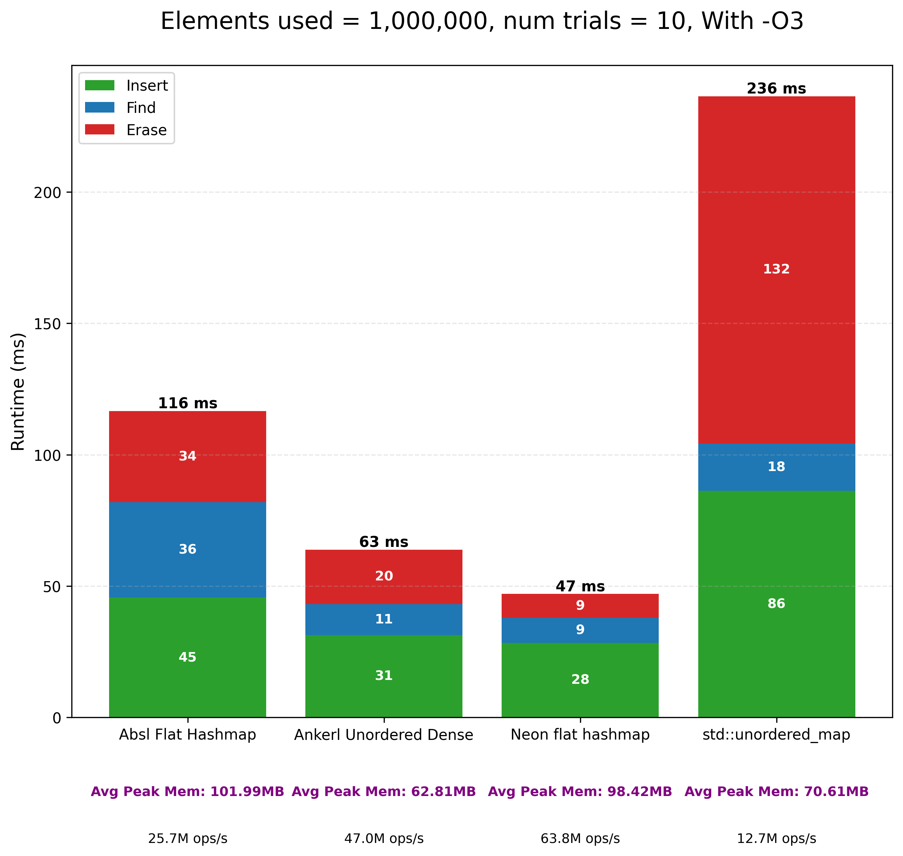
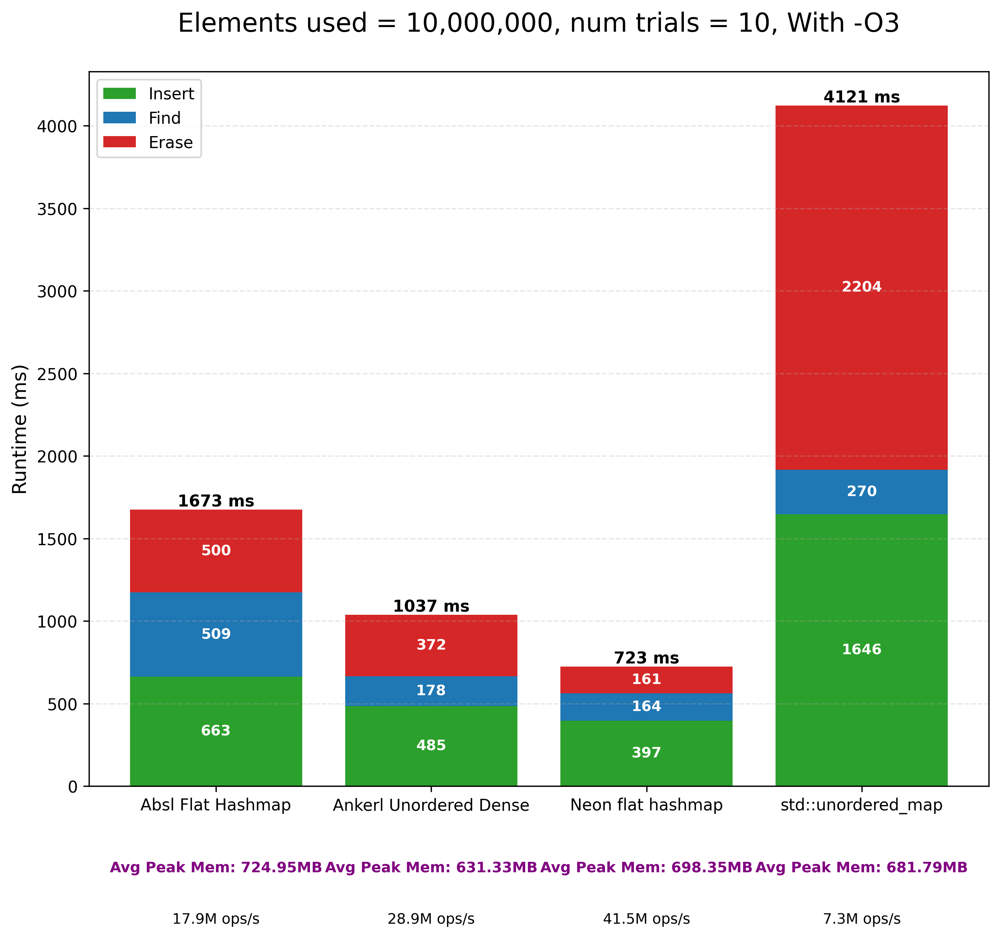
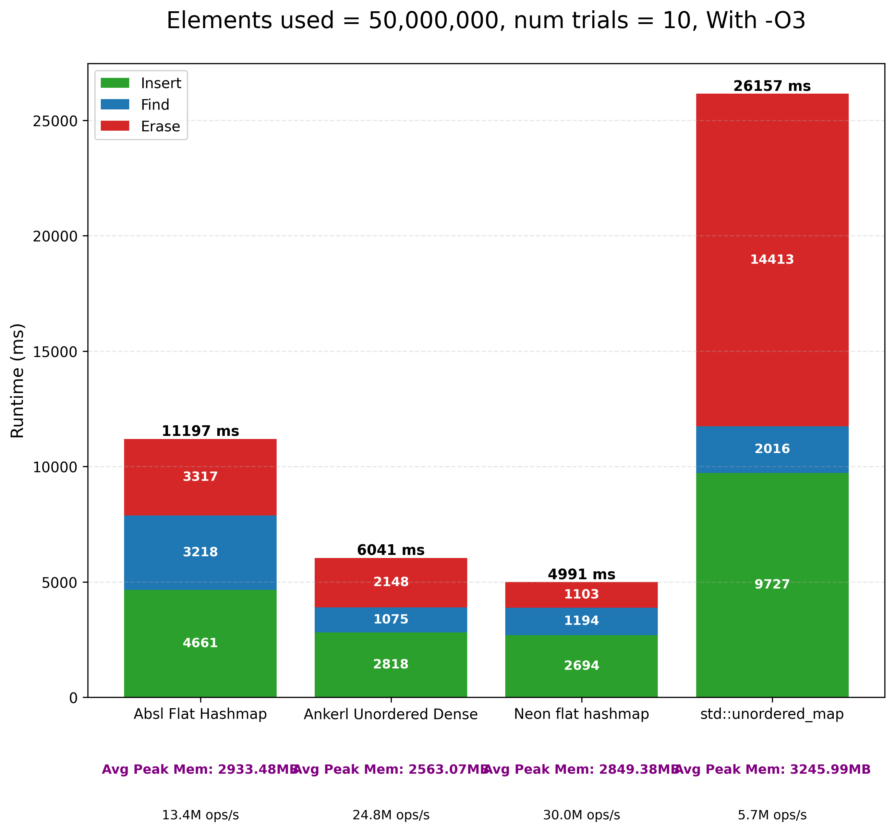

## SIMD Flat Hash Map

A high-performance open-addressing hash map implemented in C++ with:

- Header-only
- SIMD-accelerated tag matching (ARM NEON)
    - 7 bit tag used for filtering, and 57 bit hash used for matching exact entries
- Quadratic group-based probing (16 at once)
- Flat storage layout

I wanted to experiment with SIMD filtering, cache efficient designs, but also learn policy based template programming. This is similar to Google's implementation, since I wanted to learn concepts used in production-grade code.

### Small benchmark with 64bit int key, 128bit int value (Mac M1 Pro 10c)
**4 different hashmaps:**
* **std::unordered_map** (default hash)
* **Ankerl::unordered_dense::map** (default hash)
* **absl::flat_hash_map** (default hash)
* **neon::flat_hash_map** (std::hash + custom bitmixer)

**

**

